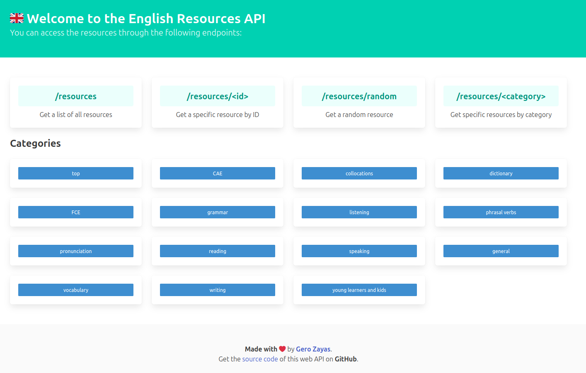

# 🇬🇧 📚 Best English Resources 🅐🅟🅘

This simple but powerful Flask API helps you have access to arguably the best curated collection of ESL resources online, both for students and educators 💻.

[🔗 Best English Resources API Link]()

### Screenshot

